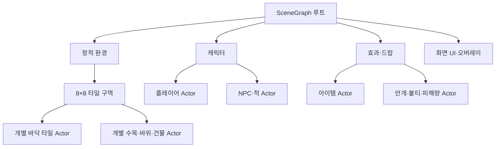

# Actor와 SceneGraph

## 1. 역할

화면에 배치되는 객체는 `Actor`로 표현한다. `SceneGraph`는 부모·자식 관계와 소유권, 갱신 순서, 표시 상태, 공간 경계와 화면 컬링을 관리한다. `Renderer`는 그래프가 제출한 도형의 깊이를 정렬하고 기존 배치 렌더링을 수행한다.

| 구성 | 책임 |
|---|---|
| Actor | 이름, 로컬 위치, 부모를 반영한 월드 위치, 갱신·표시 상태, 그리기 경계, 객체별 동작 |
| SceneGraph | 트리 소유권, 추가·삭제·부모 변경, 계층 순회, 하위 경계 캐싱, 화면 밖 하위 트리 제외 |
| Game / Level | 입력, 퀘스트·전투·성장 규칙, Actor 구성과 각 객체의 동작 연결 |
| World | 원본 타일·프롭 데이터, 맵 생성, 이동 가능 영역과 충돌 판정 |
| Renderer | 쿼터뷰 투영, 도형 제출 버퍼, 깊이 정렬, 셰이더와 GPU 배치 출력 |

하나의 캐릭터나 UI 패널은 여러 도형으로 이루어진 하나의 논리적 Actor가 될 수 있다. 원·사각형·삼각형 같은 메시 구성 요소는 그 Actor의 렌더링에서 제출한다.

## 2. 배치 구조

씬마다 필요한 그룹을 만든다. 정적 환경의 갱신을 비활성화하면 타일 수만큼 Update 콜백을 순회하지 않는다. 플레이어·적·아이템의 위치는 Actor가 보유하고, 퀘스트·체력·경험치 등의 게임 규칙은 기존 씬 코드에서 관리한다.

## 3. 컬링과 클리핑

각 월드 Actor에는 투영된 화면상 경계를 지정한다. 지형·캐릭터의 높이, 그림자, 불꽃과 흔들림의 범위를 모두 포함하는 여유 있는 경계를 사용한다.

1. 자식들의 경계를 합쳐 구역의 경계를 만든다.
2. 카메라와 창 크기로 현재 보이는 사각 영역을 구한다.
3. 구역 경계가 화면 밖이면 그 구역의 자식들을 렌더 순회하지 않는다.
4. 겹치는 구역만 내려가서 개별 Actor의 경계를 검사한다.
5. 보이는 Actor가 도형을 제출하면 Renderer가 기존 방식으로 깊이를 정렬한다.

구역 경계는 캐싱한다. 오브젝트의 로컬 위치·표시 상태·경계나 부모 관계가 바뀌면 관련 상위 경계를 갱신한다. 카메라가 움직였다는 이유만으로 정적 지형 경계를 다시 만들지 않는다.

화면에 일부 걸친 도형의 최종 픽셀 클리핑은 OpenGL 뷰포트가 처리한다. SceneGraph는 도형 제출 이전에 화면 밖 하위 트리를 제외하는 역할을 맡는다. UI 패널 내부의 별도 스크롤·사각형 마스크는 이번 구현 범위에 포함하지 않는다.

## 4. 좌표와 경계

`Actor::SetPosition(x, y, z)`는 부모 기준 로컬 위치를 지정한다. `GetWorldPosition()`은 부모들의 위치를 더한 월드 위치를 반환한다. 현 쿼터뷰 모델에 맞춰 우선 위치 계층을 지원하며, 회전·스케일 행렬의 계층 합성은 별도 확장 대상이다.

`SetRenderBounds(minX, minY, maxX, maxY)`는 Actor의 투영된 발치 기준 픽셀 경계다. 예를 들어 지면 타일은 대략 가로 ±32, 세로 ±16픽셀이며, 물결의 움직임만큼 여유를 추가한다. 수목은 줄기 위치보다 훨씬 위에 잎이 있으므로 전체 수관 높이를 포함해야 한다.

UI처럼 창 크기에 맞춰 좌표를 직접 계산하는 Actor는 유한 경계를 지정하지 않고 항상 화면 순회 대상에 둔다. UI 그룹의 표시 여부는 씬 상태에 따라 제어한다.

현재 고정 UI 패널의 배치는 각 렌더 콜백이 창 크기로 계산한다. UI Actor의 위치를 바꾸는 것만으로 패널 내부 좌표가 이동하지는 않는다.

## 5. 갱신·표시·수명

- `SetActive(false)`: 해당 Actor와 자식들의 갱신을 중지한다.
- `SetVisible(false)`: 해당 Actor와 자식들의 화면 제출을 중지한다.
- 표시 상태와 갱신 상태는 독립적이다. 죽은 적은 숨긴 상태에서도 재등장 시간을 갱신할 수 있다.
- 화면 밖이라는 이유만으로 적 AI나 전투 시간을 멈추지 않는다. 컬링은 렌더 제출에 적용한다.
- SceneGraph가 Actor를 소유한다. 게임 코드의 `Actor*`는 참조용이며 직접 delete하지 않는다.
- 반복 생성되는 드랍·피해량은 비활성 슬롯을 재사용해 메모리 할당과 노드 추가를 줄인다.
- Actor 또는 그 부모가 제거되면 기존 포인터를 더 이상 사용하지 않는다.

`Reparent(actor, parent, true)`는 월드 위치를 유지한 채 부모를 바꾼다. 자기 자신이나 자신의 자식 아래로 이동하는 순환 구조와 다른 그래프의 부모를 지정하는 요청은 거부한다.

순회 도중 추가한 Actor는 다음 순회부터 참여한다. 삭제는 이후 콜백을 즉시 중지하되 진행 중인 콜백이 끝날 때까지 객체의 메모리를 유지한다. 부모 변경으로 같은 Actor가 한 순회에서 두 번 호출되지 않는다. 이미 순회한 가지로 옮긴 객체는 다음 순회까지 호출이 미뤄질 수 있다.

`Game::GetSceneGraph()`와 `Level::GetSceneGraph()`로 각 씬의 그래프에 접근한다. 루트의 자식 조회와 부모 변경 API로 배치 계층을 제어할 수 있다. 직전 렌더 순회의 `GetVisitedActorCount()`, `GetCulledActorCount()`, `GetSubmittedActorCount()`는 각각 방문한 노드, 제외한 가지, 도형 제출 콜백을 호출한 Actor 수를 제공한다. 제외 수에는 화면 밖·숨김·빈 가지가 모두 포함되며, 제외한 가지 내부의 모든 자식 수를 세는 방식은 아니다.

현재 씬은 플레이어·적·프롭 등의 Actor 포인터를 보관한다. 이 객체와 부모의 삭제·`Clear()`는 씬의 수명 관리 경로에서만 수행해야 한다. 외부 제어는 위치·표시·갱신 상태·부모 변경에 한정하며, 외부 삭제 후에도 게임 참조를 자동 복구하는 핸들 시스템은 아직 없다.

## 6. 기존 시스템과의 관계

모델 캐시와 셰이더 애니메이션은 계속 사용한다. Actor는 캐시된 모델을 어느 위치에서 어떤 상태로 그릴지 결정한다. SceneGraph가 도형 배치 렌더링을 대체하지 않으므로 기존 단일 도형 배치와 텍스트 패스는 유지된다.

정적 지형의 충돌은 원래 World 맵 데이터를 사용한다. 씬 그래프에서 건물이나 지형 그룹을 임의로 이동하면 충돌 지형까지 자동 재작성되는 것은 아니다. 이번 작업의 그래프는 배치·표시·컬링을 관리하며, 동적으로 편집한 지형의 충돌 갱신은 별도 연동이 필요하다.

## 7. 이번 변경으로 얻은 효과

| 항목 | 변경 전 | 현재 구현의 효과 |
|---|---|---|
| 배치 제어 | 씬별 좌표 변수와 개별 그리기 함수에서 객체를 관리 | 위치·표시·갱신 제어를 Actor로 모으고, 부모 하나로 하위 객체를 함께 제어 |
| 화면 밖 객체 제외 | 전체 타일을 돌며 개별 화면 포함 여부를 검사 | 8×8 구역의 경계가 화면 밖이면 자식 렌더 순회와 도형 제출을 함께 생략 |
| 경계 계산 | 각 그리기 루프에서 화면 좌표와 제외 조건을 계산 | 하위 경계를 캐싱하고 변경된 가지의 상위 경계만 갱신; 카메라 이동만으로 정적 경계를 다시 계산하지 않음 |
| 정적 객체 갱신 | 정적 지형을 별도 그리기 루프로 처리 | Actor로 전환한 뒤에도 정적 환경의 자식 Update를 생략해 새 갱신 비용을 억제 |
| 드랍·피해량 수명 | 벡터에 추가하고 만료 항목을 삭제·압축 | 비활성 Actor와 데이터 슬롯을 재사용해 반복 생성·삭제와 배열 이동을 줄임 |
| 렌더링 경로 | 깊이 정렬 후 도형 배치 출력, 텍스트는 별도 패스 | 기존 Renderer 배치를 유지하면서 제출할 객체를 앞단에서 선별 |
| 성능 확인 | 이번 변경과 비교할 실행 측정 없음 | 방문·제외·제출 Actor 수는 조회 가능; FPS·프레임 시간·메모리 개선 폭은 아직 미측정 |

예상되는 이점은 화면 밖 정적 지형에 쓰는 CPU 순회·도형 제출 작업의 감소다. 첫 경계 계산과 Actor·캐시 관리 비용도 있으므로 실제 성능 향상을 단정하지 않는다. 화면 밖 적 AI는 계속 갱신하며, 위치 이동 이외의 계층 변환·고정 UI의 위치 연동·이동한 지형의 충돌 갱신·외부 삭제 후 게임 참조 복구는 현재 지원하지 않는다.

## 8. 사용자 확인 항목

빌드·실행과 화면 확인은 사용자가 직접 수행한다.

1. 튜토리얼에서 바닥·집·수목·NPC·플레이어가 표시되는지 확인한다.
2. 카메라를 이동해 화면 경계의 나무 꼭대기·건물 지붕·불꽃이 갑자기 잘리거나 사라지지 않는지 확인한다.
3. 촌장 대화·단서 목록·목표 표식·튜토리얼 완료 화면이 기존 순서로 동작하는지 확인한다.
4. 제1레벨에서 적 처치·재등장·드랍 수집·피해량 표시를 반복한다.
5. 능력치 화면을 열어 갱신이 멈추고, 닫으면 다시 진행되는지 확인한다.
6. 같은 위치·같은 창 크기로 이전 버전과 프레임 시간을 비교한다. 실제 성능 향상 수치는 실행 측정 후 판단한다.

새 Actor를 추가할 때에는 먼저 소속 그룹과 로컬 위치를 정하고, 렌더링 전체를 포함하는 경계를 지정한다. 경계를 실제 그림보다 작게 지정하면 정상 객체도 화면 밖으로 잘못 판단할 수 있다.
