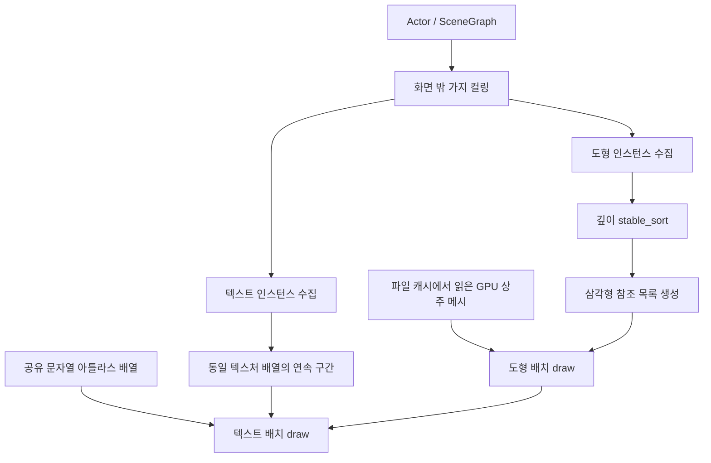

# Draw Call 최적화 리포트

작성일: 2026-09-28  
대상: 일본 중세 판타지 RPG, 2.5D 쿼터뷰, OpenGL Renderer  
근거: 현재 작업 트리와 Git HEAD의 Renderer 소스 비교  
검증 범위: 소스 분석. 빌드·게임 실행·GPU 성능 실측은 수행하지 않음.

## 1. 핵심 결론

이번 변경에서 **draw call 감소에 직접 기여한 부분은 문자열별 렌더링을 공유 텍스처 배열 기반 배치로 바꾼 것**이다. 기존 도형 렌더러도 이미 모든 도형을 모아 한 번에 그렸다. 따라서 도형 수만큼 발생하던 draw call을 한 번으로 줄였다는 설명은 현재 프로젝트의 변경 이력과 맞지 않는다.

도형 경로에서는 **메시 파일 캐시 → GPU 상주 → 인스턴스 참조** 구조를 적용했다. 이 변경의 주효과는 매 프레임의 정점 생성·삼각분할·CPU 변환을 줄이고 고정 기하를 재사용하는 것이다. 파일 캐싱 자체가 draw call을 줄이지는 않는다.

정상적인 소규모 장면에서 현재 구조는 **도형 1회 + 텍스트 1회**로 제출할 수 있다. 다만 GPU 버퍼 한도와 텍스처 배열 분할에 따라 호출 수가 늘어난다. FPS 개선 폭은 아직 확인되지 않았다.

## 2. 무엇을 줄이는가

Draw call은 CPU가 그래픽 API를 통해 GPU에 그리기 작업을 제출하는 호출이다. Actor 수, 메시 수, 삼각형 수와는 별개의 수치다. 한 번의 호출로 수천 개의 삼각형을 처리할 수 있다.

배치는 같은 셰이더·버퍼·블렌딩 상태 등으로 처리할 데이터를 모아 제출한다. 객체별 차이는 호출마다 상태를 바꾸는 대신 인스턴스 데이터로 전달한다. 이때 호출 및 상태 변경 비용을 줄일 여지가 있지만, GPU가 그릴 픽셀·삼각형까지 자동으로 줄어들지는 않는다.

| 방법 | 줄이려는 비용 | 이번 구현에서의 역할 |
|---|---|---|
| 배치 렌더링 | draw 호출 및 반복적인 제출 작업 | 도형 배치 유지, 문자열별 draw를 텍스트 배치로 통합 |
| 텍스처 아틀라스·배열 | 텍스처 변경에 따른 배치 분리 | 서로 다른 문자열 이미지를 같은 배열에 저장 |
| 인스턴싱 | 반복 기하 데이터의 제출·변환 | 상주 기하와 객체별 데이터를 분리 |
| 디스크 메시 캐시 | 실행 시작 때의 기하 생성·삼각분할 | 생성 결과를 다음 실행에서 로드 |
| GPU 메시 상주 | 프레임별 고정 기하 재업로드 | 정적 위치 데이터를 초기화 때 한 번 업로드 |
| SceneGraph 컬링 | 보이지 않는 객체의 제출·정렬·GPU 작업 | 화면 밖 하위 트리를 렌더 제출 전에 제외 |

컬링으로 제출량이 줄어도 원래 한 배치에 들어가던 장면이라면 draw call은 1회로 유지될 수 있다. 이 경우에도 CPU 처리량과 GPU 작업량 감소는 별도로 평가해야 한다.

## 3. 변경 전 병목과 변경 후 흐름

| 항목 | 변경 전 | 현재 |
|---|---|---|
| 도형 draw | 모은 삼각형 전체를 1회 제출 | 정렬된 삼각형 참조를 인스턴싱; 한도 내 1회 |
| 텍스트 draw | 문자열마다 1회 | 연속한 동일 텍스처 배열 사용 구간마다 1회 |
| 텍스트 버퍼 업로드 | 문자열마다 사각형 정점 업로드 | 전체 문자열 인스턴스 버퍼를 한 번 업로드 |
| 객체별 텍스트 색 | 문자열마다 uniform 변경 | 인스턴스 색 데이터 |
| 모델 기하 | 프레임마다 CPU 변환·삼각형 전개 | 초기 등록한 메시를 셰이더에서 참조·변환 |
| 원·타원 | 호출 때 둘레 정점 계산 | 캐시된 단위 원에 위치·크기 적용 |
| 정렬 | 깊이 기준 정렬 | 같은 깊이의 제출 순서도 보존하는 정렬 유지 |



도형 패스 후 텍스트 패스를 수행한다. 모델별로 따로 그리는 구조가 아니라, 깊이 순서를 유지한 채 서로 다른 메시를 같은 배치에서 참조한다.

## 4. 도형: 순서를 보존하는 인스턴스 배치

### 4.1 초기화와 실행을 분리

`ModelLibrary::RegisterMeshes()`에서 모델 폴리곤을 등록하고 `Renderer::PrepareMeshes()`에서 정적 위치 데이터를 GPU에 올린다. 기본 삼각형·사각형·원도 같은 방식으로 준비한다.

- `models.cache`: 모델의 도형·색·애니메이션 데이터.
- `render_meshes.cache`: 삼각분할된 기본·모델 메시 위치 데이터.
- 캐시 누락·무효 또는 원본 변경 시 초기화 과정에서 필요한 데이터를 재생성한다.
- 첫 프레임 이후에는 메시를 추가 등록하지 않고 핸들로 참조한다.

매 프레임에는 위치·크기·색·애니메이션·동적 제어점 등의 인스턴스 데이터와 삼각형 참조 목록을 만든다. **매 프레임 계산·버퍼 갱신이 모두 없어진 것은 아니다.** 정렬과 참조 목록 구성, 인스턴스 업로드는 계속 수행한다.

### 4.2 하드웨어 인스턴스 단위는 삼각형

현재 도형 구현은 같은 완성 모델을 반복하는 일반적인 모델 단위 인스턴싱과 구체적인 방식이 다르다. `glDrawArraysInstanced(GL_TRIANGLES, 0, 3, commandCount)`의 한 인스턴스는 **삼각형 하나**다.

각 참조 항목은 메시 위치 버퍼에서 읽을 첫 정점과 폴리곤 인스턴스 번호를 가진다. 셰이더가 이를 이용해 원래 정점을 읽고 변환·색·애니메이션을 적용한다. 따라서 다양한 정점 수의 메시를 깊이 순서 그대로 한 번에 제출할 수 있다.

장점은 폴리곤 단위 그림 순서 보존이다. 비용은 삼각형마다 만드는 참조 항목과 셰이더의 버퍼 조회다. 이 방식이 모든 장면에서 가장 빠르다고 결론낼 수는 없다.

### 4.3 배치를 나누는 조건

폴리곤 하나의 데이터는 RGBA32F texel 8개, 즉 128바이트다. GPU가 제공하는 `GL_MAX_TEXTURE_BUFFER_SIZE`를 `L`이라고 하면 한 배치의 폴리곤 한도는 다음과 같다.

```text
B = floor(L / 8)
P = 화면 컬링 후 제출한 폴리곤 수
D_world = ceil(P / B)       (P = 0이면 0)
```

이 식은 메시 준비에 성공한 현재 렌더 경로를 전제로 한다. 현재는 texture buffer 한도로만 분할하므로 대규모 확장 시에는 삼각형 명령 수와 GLsizei 범위, 업로드 크기에 대한 별도 상한도 검토해야 한다.

## 5. 텍스트: 문자열별 draw 제거

기존 경로는 문자열마다 고유 텍스처를 바인딩하고 사각형 정점을 업로드한 뒤 draw했다. HUD, 대화, 능력치 화면에서 문자열 수가 늘면 draw call도 함께 늘어났다.

현재는 문자열 이미지를 GDI로 한 번 래스터화해 **공유 R8 텍스처 아틀라스 배열**에 넣는다. 각 문자열은 화면 사각형, UV 영역, 색, 배열 레이어 번호만 전달한다. 같은 배열 안에서는 문자열과 레이어가 달라도 한 배치로 처리한다. 구현은 글자별 캐시가 아니라 **문자열 전체 캐시**다.

기본 배열 크기는 2048×2048×4다. 이 크기의 R8 픽셀 데이터는 약 16MiB이며 실제 드라이버 메모리 점유량과는 다르다. GPU 한도나 긴 문자열에 따라 배열 크기가 달라질 수 있다.

배열이 여러 개면 제출 순서에서 **동일 배열을 사용하는 연속 구간**마다 draw한다.

```text
텍스트 제출의 배열 순서: A A A A       → 1회
텍스트 제출의 배열 순서: A A B B       → 2회
텍스트 제출의 배열 순서: A B A         → 3회
```

따라서 텍스트 draw 수는 고유 배열 개수와 항상 같지 않다. 반투명 텍스트의 겹침 순서를 보존하기 위해 배열별로 임의 재정렬하지 않는다.

### 호출 수 계산 예시 — 실측값 아님

도형이 있고 모두 한 배치에 들어가며, 텍스트가 배열 하나를 공유한다고 가정한다.

| 문자열 수 | 변경 전 총 draw | 현재 총 draw | 계산상 감소율 |
|---:|---:|---:|---:|
| 10 | 11 | 2 | 약 81.8% |
| 30 | 31 | 2 | 약 93.5% |
| 60 | 61 | 2 | 약 96.7% |

현재 총 호출 수는 `D_world + 텍스트 배열 연속 구간 수`다. 위 감소율은 **호출 횟수에 대한 예시**이며 프레임 시간 감소율이나 FPS 증가율이 아니다.

## 6. 렌더링 품질을 유지하기 위한 제약

현재 프로젝트는 깊이 테스트를 끄고 알파 블렌딩과 화가 알고리즘을 사용한다. 그림자, 등불 헤일로, 안개, 반투명 적은 순서를 바꾸면 표현이 달라질 수 있다.

이 때문에 폴리곤은 `stable_sort`로 깊이를 정렬하고 같은 깊이에서는 제출 순서를 유지한다. 모델·재질을 기준으로 재정렬해 호출 수만 줄이는 방식은 그대로 적용하기 어렵다. 텍스트도 원래 제출 순서를 유지한다.

향후 UI 마스크, 서로 다른 블렌딩 방식, 별도 렌더 타깃이나 셰이더 패스를 도입하면 배치 경계가 추가될 수 있다. draw call 2회를 고정 요구사항으로 삼기보다 **필요한 렌더 상태와 순서를 유지하면서 불필요한 분리를 줄이는 것**을 기준으로 삼아야 한다.

## 7. 현재 남아 있는 비용과 한계

| 항목 | 남아 있는 작업 / 주의점 |
|---|---|
| CPU 제출 | Actor 순회, 화면 투영·조명 계산, 인스턴스 수집 |
| CPU 정렬 | 매 프레임 폴리곤 깊이 정렬 |
| 명령 구성 | 폴리곤별 삼각형 참조 목록 생성 |
| 업로드 | 인스턴스·참조 목록·텍스트 데이터의 프레임별 갱신 |
| GPU 조회 | 정점 셰이더에서 상주 메시·인스턴스 데이터 읽기 |
| 픽셀 처리 | 반투명 효과가 겹치는 영역의 반복 그리기 |
| 텍스트 캐시 | 새로운 문자열의 래스터화·텍스처 업로드; 512개 초과 시 다음 프레임 캐시 초기화 |

현재 Windows 데이터 레이아웃 기준 동적 업로드량은 대략 다음과 같다.

```text
128 × 폴리곤 수 + 8 × 삼각형 수 + 52 × 문자열 수 [bytes/frame]
```

실제 통계는 코드의 `sizeof`를 사용한다. 위 식에는 초기 정적 메시와 새 문자열 이미지 업로드가 포함되지 않는다. 단순한 도형은 고정 크기 인스턴스 데이터의 비중이 클 수 있으므로 업로드량이 반드시 줄었다고 단정하면 안 된다. 캐시와 배치의 효과는 CPU 시간·GPU 시간·업로드량을 함께 비교해야 한다.

## 8. 로그를 이용한 평가 방법

동일한 빌드 설정·GPU·창 크기·맵 시드·이동 경로로 변경 전후를 비교한다. 초기 캐시 생성 구간, 정상 플레이, 대화·능력치 화면, 피해량 텍스트가 많은 전투 구간을 분리한다. F9 마커로 비교 구간의 시작과 끝을 남긴다.

| 확인 목적 | 로그 항목 | 판정 시 유의점 |
|---|---|---|
| 호출 통합 효과 | `world_draws`, `text_draws` | 평균뿐 아니라 UI 전환 시 최대도 확인 |
| CPU 효과 | `render_cpu_ms`, `world_submit_cpu_ms`, `text_submit_cpu_ms`, `sort_cpu_ms` | 포함 관계가 있으므로 모두 합산하지 않음 |
| 업로드 부담 | `instance_upload_bytes`, `polygons`, `triangles`, `texts` | 장면 제출량이 같은지 먼저 확인 |
| GPU 부담 | `gpu_elapsed_ms`, `gpu_source_frame` | 비동기 결과를 원래 프레임 ID와 연결 |
| 체감 안정성 | 프레임 간격 p95·p99·최대, `clamped_updates` | 평균 FPS만으로 판단하지 않음 |
| 텍스트 재생성 | 캐시 miss/reset 누적값의 차분 | 프레임 지연과 발생 시점 비교 |
| 컬링 효과 | `visited_nodes`, `culled_branches`, `submitted_actors` | culled는 제외 가지 수이며 전체 제외 Actor 수가 아님 |
| 측정 비용 | `previous_logger_cpu_ms`, `swap_cpu_ms` | 로깅 비용과 화면 교체 대기 영향 구분 |

현재 작업 폴더에서 비교할 실측 로그는 확인되지 않았다. 이전 리비전에는 새 CSV 계측이 없으므로 엄밀한 전후 비교에는 동일한 계측을 적용한 기준 빌드가 필요하다. 기준 빌드 없이 현재 로그만으로 FPS 개선율을 주장하지 않는다.

사용자 확인용 결과 표:

| 동일 장면 측정값 | 기준 빌드 | 현재 빌드 |
|---|---|---|
| draw 평균 / 최대 | 미측정 | 미측정 |
| CPU Render 평균 / p95 | 미측정 | 미측정 |
| GPU 평균 | 미측정 | 미측정 |
| 프레임 간격 p95 / p99 | 미측정 | 미측정 |
| 인스턴스 업로드 bytes/frame | 미측정 | 미측정 |

## 9. 후속 개선의 우선순위

아래는 현재 구현에 대한 조건부 검토 항목이며 이번 리포트에서 추가 구현하지 않았다.

1. **텍스트 draw가 다시 늘 때**: 아틀라스 분할과 `A→B→A` 전환을 먼저 조사한다. 수명·사용 화면을 고려한 배치와 저장 공간 활용을 검토하되 표시 순서를 유지한다.
2. **텍스트 캐시 miss/reset과 지연이 겹칠 때**: 자주 바뀌는 숫자 HUD를 별도 관리하거나 글리프 캐시를 검토한다. draw가 이미 적어도 래스터화 비용은 남는다.
3. **정렬·업로드가 주된 비용일 때**: 변경되지 않는 정적 데이터 재사용과 인스턴스 형식 축소를 검토한다. 카메라·조명·투명도 순서 때문에 무엇이 실제로 불변인지 먼저 구분해야 한다.
4. **화면 밖 제출이 많을 때**: Actor 경계와 청크 분할을 조정한다. draw 수가 유지되어도 제출량과 GPU 부하가 줄어드는지 확인한다.
5. **CPU 제출은 짧고 GPU 시간이 길 때**: 반투명 겹침, 효과 면적, 메시 복잡도, 셰이더 조회 비용을 조사한다. 도형·텍스트를 억지로 한 패스로 합치는 작업을 먼저 할 근거는 없다.

## 10. 코드 근거와 관련 문서

| 근거 | 역할 |
|---|---|
| [Renderer.cpp](C:/Users/jinseok/OneDrive/Desktop/class/26-2/game_software/gsw_BaseProject_SE/SimpleGame/Renderer.cpp) | `PrepareMeshes`, `FlushPolygons`, `FlushText`, 실제 draw 통계 |
| [Renderer.h](C:/Users/jinseok/OneDrive/Desktop/class/26-2/game_software/gsw_BaseProject_SE/SimpleGame/Renderer.h) | 폴리곤·삼각형 명령·텍스트 인스턴스 형식 |
| [Batch.vs](C:/Users/jinseok/OneDrive/Desktop/class/26-2/game_software/gsw_BaseProject_SE/SimpleGame/Shaders/Batch.vs) | 메시 참조, 변환, 셰이더 애니메이션 |
| [TextRenderer.cpp](C:/Users/jinseok/OneDrive/Desktop/class/26-2/game_software/gsw_BaseProject_SE/SimpleGame/TextRenderer.cpp) | 문자열 캐시와 공유 아틀라스 배열 |
| [배치 렌더링 구현 문서](C:/Users/jinseok/OneDrive/Desktop/class/26-2/game_software/gsw_BaseProject_SE/렌더링_배치_메시캐시.md) | 메시 등록·캐시 규칙·화면 확인 항목 |
| [성능 분석 로그 문서](C:/Users/jinseok/OneDrive/Desktop/class/26-2/game_software/gsw_BaseProject_SE/성능_분석_로그.md) | CSV 의미·수집 설정·재현 조건·보관 정책 |
